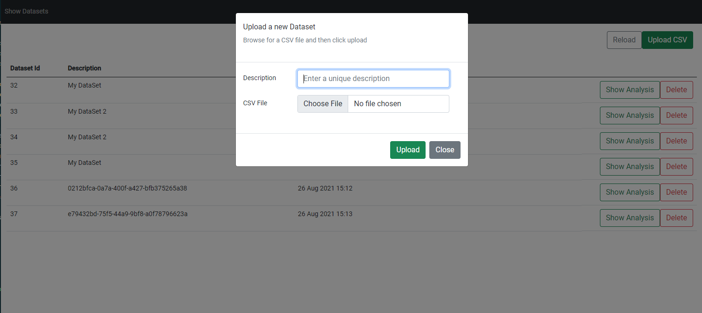

# Market Price Data Analysis Demo

This is a .NET 5 Web API / Entity Framework / MS SQL Server / Angular 12 based web application which allows the user to a upload and save market price related dataset (in the specified CSV file format). Once the data has been saved to the database, the user can then view the data in graph format (powered by Chart.js) and also view specific analysis calculations - e.g. the min price, max price, average and the most expensive hour window.

To run the server: 
- Open the server/GridBeyondDemo.sln file in in Visual Studio.	
- Ensure you have dotnet 5 SDK installed and then build the project	
- The database layer uses the entity framework v5, and technically, once the DB connection string in server/GridBeyondDemo/appsetting.json is valid (assuming you've a local instance of SQL server), the app should run the db migration scripts and launch the URL **https://localhost:5001/api/Ping**

To run the client: 

- You will require node.js and npm to run the client
	
- You will require the angular cli:
	
```sh
$ npm install -g @angular/cli
```
	
- navigate to the client folder and run the command: 
	
```sh
$ npm start
```
	
- This command will install the dependancies and serve the app to **http://localhost:4200**

You should be presented with a similar view - without any existing datasets added


To upload a new dataset in CSV format, click on the **Upload CSV** button



Add a description and select the CSV file to upload. When the file is uploaded, reload the datasets list to see the new import. Click on **Show Analysis** to view the analysis page 


